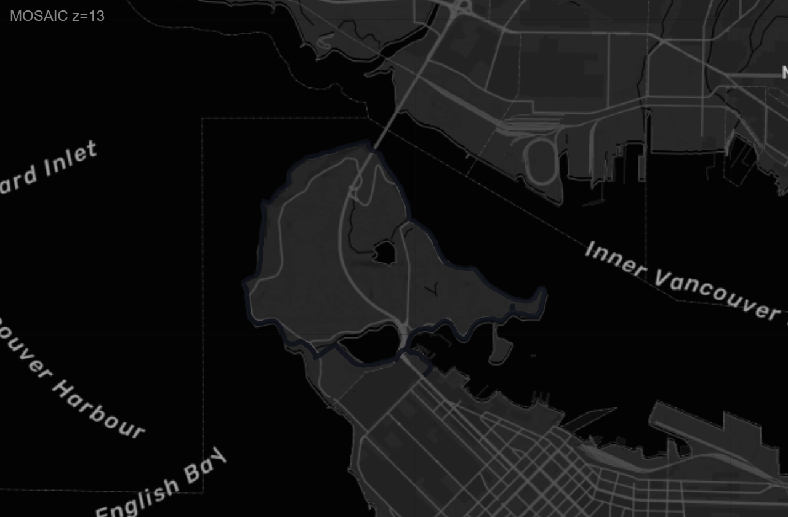
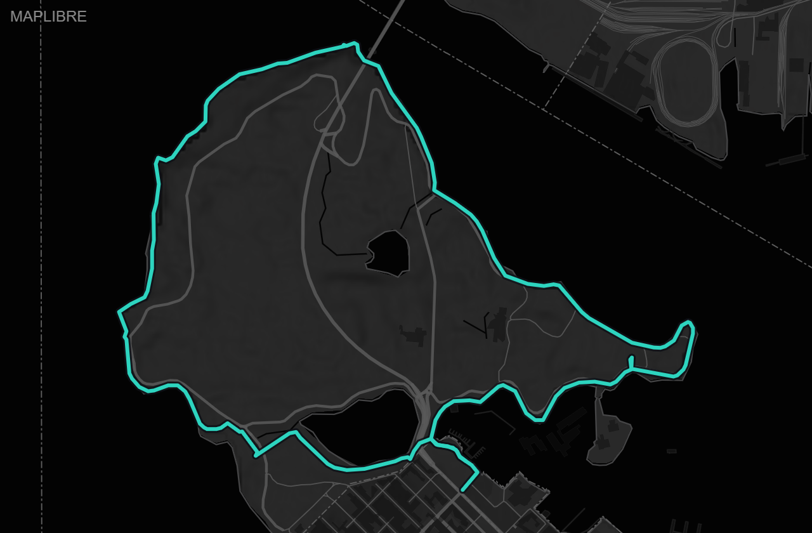
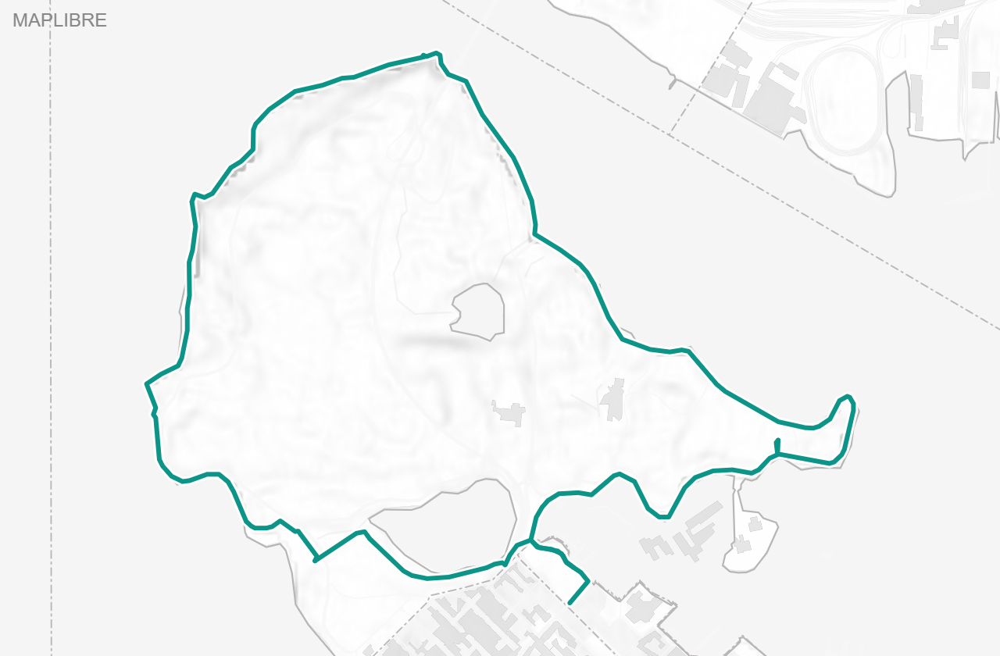
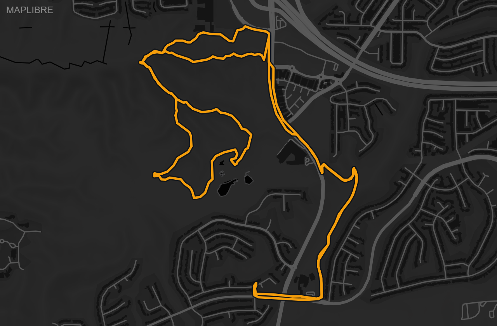

# Future work: a basemap behind the Activity-Details mini-map

**Status:** Phase 1 shipped ✅ · Phase 2 proposed (basemap) · **Current preference: MapLibre GL**
**Created:** 2026-07-18 · **Updated:** 2026-07-18 (spike results folded in) · **Owner:** unassigned

## TL;DR

The Activity Details panel now shows a **tile-free route sketch + violet elevation
profile** for every GPS activity (Phase 1, shipped). This doc covers the remaining
work: putting a **map basemap behind the route**. A spike settled the two big
unknowns — the originally-planned MapTiler **Static Maps API is blocked on the
current plan**, and of the two free-tier alternatives, **MapLibre GL is the
preferred approach**. Details, evidence, and the build sketch below.

---

## Phase 1 — what shipped (route + elevation, tile-free)

Delivered on branch `claude/detail-minimap-route-elevation`
(commit `6d62d93`); spec entry: `Specs/strava-data/dashboard-spec.md`
("Activity Details mini-map — route + elevation").

- `_activity_geo_json(rows)` (`page.py`) builds `GEO_DATA = { id: {path, elev, sport} }`
  for GPS activities only (325 of 350; 25 indoor omitted), reusing
  `_load_trip_geo(aid, cap=64)`. Emitted as `var GEO_DATA` and threaded through
  `build_js`.
- `miniMap(a)` (`template.py`) returns an **inline SVG** appended in `renderActivity`
  — a sport-colored route (teal run / amber MTB) with a contrast casing, over a
  violet `var(--elevation)` elevation area. No draw hook; themes for free via CSS
  vars; stacks cleanly for multi-activity days.
- Gitignored `.env` support added (`config.py` `load_dotenv`; `.env.example`) so a
  local `MAPTILER_KEY` need not be exported by hand — groundwork for Phase 2.

Phase 1 is self-sufficient and looks good on its own. Everything below is additive.

---

## Phase 2 — the basemap (proposed)

**Goal:** render a lightweight **static** (no pan/zoom) basemap behind the route,
matching the Places hero's **Glow** styling in both themes, so the track reads
against real streets/coastline instead of empty space. The elevation profile and
the tile-free fallback from Phase 1 stay exactly as they are.

### Spike finding #1 — the original approach is blocked (pricing, not code)

The original plan (and the pre-spike version of this doc) was built on the MapTiler
**Static Maps API**: one `.../static/{lon},{lat},{zoom}/{w}x{h}.png` request per
opened activity. **That endpoint returns `403` on the current MapTiler plan** — its
un-entitled placeholder image literally reads *"Invalid key"*, even though the same
key + `127.0.0.1` origin serves tiles fine. Static Maps is a paid MapTiler feature.

| Request (same key, `Referer: 127.0.0.1`) | Result |
|---|---|
| Static map (`@2x`, plain, and `/static/auto/`) | **403 — "Invalid key" placeholder** |
| Vector `style.json` (what the hero uses) | **200 ✅** |
| Raster tile `/maps/{style}/256/{z}/{x}/{y}.png` | **200 ✅** |

So the basemap must come from **tiles** (which work), not the static-render service —
or the MapTiler plan must be upgraded (see Option C).

### Spike finding #2 — the Web-Mercator projection is solved

The build-time projection needed to land the route on the roads (slippy-map
zoom-to-fit → center → per-point lon/lat→pixel, mirroring `tools/gen_hillshade.py`)
was written and **validated**: overlaid on a real raster-tile mosaic, the route
traces the Stanley Park seawall and the trail loops exactly. Alignment is not a
risk.

### The two free-tier options evaluated

Both were mocked over the same GPS tracks (Stanley Park ride, a trail run, an MTB
loop); **both align correctly**.

**Option A — raster-tile mosaic.** SVG `<image>` tiles from the working
`/256/{z}/{x}/{y}.png` endpoint, placed by the Python mercator math, with the route
polyline overlaid (pure markup, exactly like Phase 1).

**Option B — MapLibre GL per panel.** A tiny `interactive:false` MapLibre map built
from the hero's `style.json`, with the route drawn as native line layers and
`fitBounds` to the track. MapLibre owns the projection.

| | **A — Raster-tile mosaic** | **B — MapLibre GL** ⭐ |
|---|---|---|
| Alignment | ✅ (our mercator math) | ✅ (MapLibre's) |
| Look | Dimmer route, softer tiles; **integer-zoom only** → route smaller, more empty margin | **Crisp** vector @2×; **vivid** route + casing halo; fractional-zoom `fitBounds` fills the frame |
| Light theme | ❌ custom light-Glow has **no free raster tiles** (403) → would need a standard light slug that won't match the hero | ✅ renders the custom light-Glow via vector — **matches the hero, both themes** |
| Tech | Pure SVG markup; no WebGL, no JS lib; drops into `innerHTML` like Phase 1 | WebGL + MapLibre lib (already loaded for the hero); one map per panel, post-injection init |
| `showDay` stacking | ✅ N independent SVGs, no limits | ⚠️ N live **WebGL contexts** (browser cap ~16) → needs lazy-init / instance reuse |
| Requests / map | ~8–12 raster tiles | ~28–33 vector tiles |
| Cost | Free tier | Free tier |
| Custom projection code | Yes (maintained by us) | None |

Dark, same ride — mosaic vs MapLibre:

Light theme — the mosaic tiles the "Invalid key" placeholder (custom Glow style is
paid to raster-render); MapLibre renders it cleanly:

MapLibre also nails alignment + color on trail/MTB tracks:

---

## Decision: prefer **Option B — MapLibre GL**

**Why:** it is the only option that matches the Places hero in **both themes** (the
custom light-Glow style renders for free via vector tiles), it is markedly
**crisper and more legible** (vivid route + casing halo, tight fractional-zoom fit),
and it needs **no bespoke projection code** to maintain. It also reuses
infrastructure already on the page — MapLibre is loaded for the hero, and the hero's
`SLUGS` / `styleForMode` / `GLOW_LIGHT_STYLE_ID` wiring can be shared.

The raster-tile mosaic stays documented as a **fallback** (Option A) — it is
lighter-weight (no WebGL, no context limits) and could be the better fit *if* the
per-panel WebGL cost or the `showDay` context limit proves troublesome. Its cost:
integer-zoom-only framing, a dimmer route, and **no hero-matching light theme**.

Option C (upgrade the MapTiler plan to include Static Maps) is a money decision, not
a code one; it would let the original single-`<image>` approach work almost as first
written, but it is not preferred given a free-tier path exists.

---

## Build sketch (Option B — MapLibre GL)

- **Keep Phase 1 intact:** `GEO_DATA.path`/`elev` still drive the elevation profile
  and the **tile-free fallback** (when no key, or no WebGL). Add per-activity `bbox`
  (or reuse the raw decimated lat/lng) so the route can be built as GeoJSON and
  `fitBounds` has a target.
- **Post-injection init:** `renderActivity` returns an HTML string, so it emits a
  map **container** `
` (with the activity id + a `hasGeo` marker). After
  `openPanel` writes the `innerHTML`, an init pass walks the new containers and
  builds one `maplibregl.Map({interactive:false, attributionControl:false})` each,
  style = `styleForMode()` (shared with the hero), then adds a **casing** line layer
  + a **sport-colored** route line layer and calls `fitBounds(bbox, {padding, animate:false})`.
- **`showDay` stacking (the one real risk):** don't init every stacked map eagerly.
  Use an `IntersectionObserver` to init a block's map only when it scrolls into view,
  and **destroy** maps on panel close (`map.remove()`) to free WebGL contexts. If
  that still strains the ~16-context cap, fall back to the doc's earlier idea:
  collapse all-but-the-first map behind a tap.
- **Theme toggle while open:** on `.light` toggle, either `map.setStyle(styleForMode())`
  on each open map, or re-init the panel. (The route/elevation still theme via CSS
  vars as in Phase 1; only the basemap style needs the swap.)
- **Shared style source of truth:** lift the hero's `SLUGS` / `styleForMode` /
  `GLOW_LIGHT_STYLE_ID` into a shared spot so hero and mini-map cannot drift.
- **Graceful degradation:** if `MAPTILER_KEY` is empty or `window.maplibregl` is
  missing, skip map init and keep the Phase 1 tile-free SVG — identical to how the
  hero degrades.

## Verification

1. Put the key in `strava-data/.env`; rebuild `uv run python strava-data/build_dashboard.py`.
2. Open the panel from a calendar day and from HR/Pace chart-point clicks, on
   **desktop** (420px panel) and **mobile** (bottom sheet), in **light + dark**.
   Confirm: the basemap renders in both themes (custom light-Glow included), the
   route sits on the roads, the casing stays legible, and the elevation profile is
   unchanged from Phase 1.
3. **`showDay` with several GPS activities:** confirm lazy-init works, maps free
   their contexts on close, and no "too many WebGL contexts" console warnings.
4. Empty the key (or block the MapLibre CDN) and confirm the **tile-free fallback**
   still renders route + elevation.
5. Spot-check one activity's basemap-aligned track against Strava's own map for that id.

## Related

- Places hero (MapLibre + MapTiler, Glow/Terrain styles, contrast casing):
  `Handoffs/strava-data/places-maplibre-handoff.md`,
  `Plans/strava-data/places-basemap-plan.md`,
  `Plans/strava-data/places-basemap-contrast-future-work.md`.
- Sibling Activity Details improvement:
  `Plans/strava-data/activity-links-future-work.md` (Strava click-through on the name).
- Spike screenshots: `Plans/strava-data/detail-minimap-assets/`.
